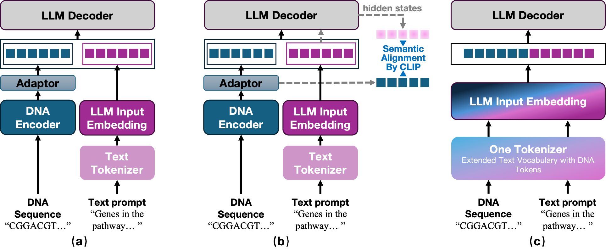

  <h1>Mind the Gap No More: Achieving Zero-Gap Multimodal Integration via One Tokenizer</h1>

  <a href="https://arxiv.org/pdf/2602.12286">[Paper]</a>

  

# Overview
This is the official repository of our paper "Mind the Gap No More: Achieving Zero-Gap Multimodal Integration via One Tokenizer". 

# Abstract 
A central challenge in developing Multimodal Large Language Models (MLLMs) is effectively integrating heterogeneous inputs into a cohesive reasoning engine. Current paradigms predominantly rely on modular architectures that introduce modality-specific encoders and cross-modal fusion mechanisms. However, these designs are fundamentally bottlenecked by a geometric modality gap, forcing the LLM to expend significant computational capacity on geometric reconciliation rather than deep cross-modal reasoning. In this work, we formally characterize this modality gap and theoretically demonstrate that native architectures, specifically those employing a unified vocabulary, intrinsically maintain a zero-gap state across all hidden layers. 
Guided by these theoretical findings, we propose *One Tokenizer*, a native architecture that maps all modalities directly into a shared token space. We empirically validate this framework on a DNA--text multimodal testbed. Our extensive evaluations reveal that by achieving seamless integration within the LLM's native latent space, One Tokenizer consistently outperforms encoder-based modular counterparts, providing a fundamentally superior framework for deep biological reasoning.

# Citation
If you find this repository useful, you can cite it as: 

@misc{li2026mindgapmoreachieving,

      title={Mind the Gap No More: Achieving Zero-Gap Multimodal Integration via One Tokenizer}, 
      
      author={Yanan Li and Christina Yi Jin and Yuan Jin and Manli Luo and Tie Xu and Shuai Jiao and Wei He and Qing Zhang},
      
      year={2026},
      
      eprint={2602.12286},
      
      archivePrefix={arXiv},
      
      primaryClass={q-bio.GN},
      
      url={https://arxiv.org/abs/2602.12286}, 
}

